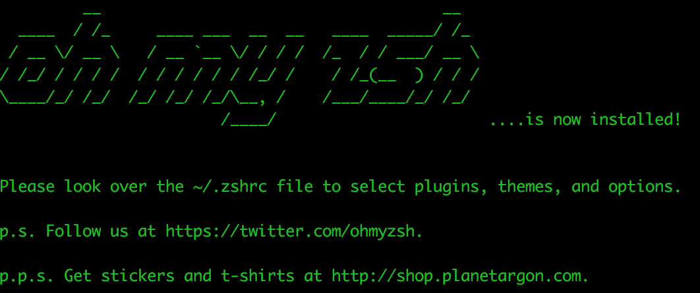
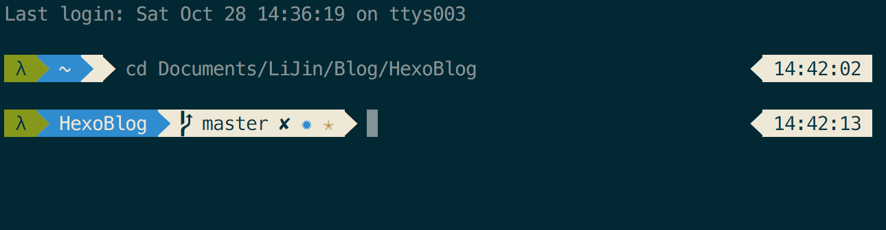

## 前言

Shell 是 Linux/Unix 的一个外壳，它负责外界与 Linux 内核的交互，接收用户或其他应用程序的命令，然后把这些命令转化成内核能理解的语言，传给内核，内核是真正干活的，干完之后再把结果返回用户或应用程序。

Mac 的最大优势是 GUI 和命令行的完美结合，本文介绍如何使用 iTerm2 和 oh my zsh 打造 Mac 最强终端。

<!--more-->

## iTerm2

iTerm2 是一个终端模拟器，官方网站：http://www.iterm2.com/

### 安装

直接去 [官网](http://www.iterm2.com/) 下载就可以

### 更改配色

iTerm2 比较好看的配色方案当属 `Solarized` ，直接在 `iTerm2 - Preferences - Profiles - Colors` 里面配置就好了，我使用的是 Solarized-Dark。

### 更改 powerline 字体

1.安装 Powerline

下载 Powerline 工程

```
$ git clone https://github.com/powerline/fonts.git --depth=1
```

将工程下载下来后 cd 到 install.sh 文件所在目录，然后执行 `./install.sh` 指令安装所有 Powerline 字体

```
$ cd fonts
$ ./install.sh
```

安装完成后，删除下载的工程，也可以不清，主要是为了保持电脑空间干净整洁

```
$ cd ..
$ rm -rf fonts
```

2.设置 iTerm 2 的字体

安装完字体库之后，在 `iTerm2 - Preferences - Profiles - Text` 选项卡中里的字体设置成 Powerline 的字体，我这里设置的字体是 `Meslo LG M DZ for Powerline`。


## oh my zsh

Mac 终端默认使用的 Shell 是 bash，设置当前用户使用 zsh：

```
$ chsh -s /bin/zsh
```

执行命令后，根据提示输入当前用户的密码就可以了。

如果以后想恢复为 bash，可执行 

```
$ chsh -s /bin/bash
```

### 安装

执行下面的两个命令可以自动安装：

```
$ wget https://github.com/robbyrussell/oh-my-zsh/raw/master/tools/install.sh -O - | sh
```

或者

```
$ curl -L https://raw.github.com/robbyrussell/oh-my-zsh/master/tools/install.sh | sh
```

安装完后会输出这样的结果：



### 配置

zsh 的配置主要集中在用户目录的 .zshrc 里，用 vim 或你喜欢的其他编辑器打开.zshrc，在最下面会发现这么一行字：

    # Customize to your needs…

可以在此处定义自己的环境变量和别名，当然，oh my zsh 在安装时已经自动读取当前的环境变量并进行了设置，你可以继续追加其他环境变量。

```
alias zshconfig="sublime ~/.zshrc"
alias ohmyzsh="sublime ~/.oh-my-zsh"
alias cls='clear'
alias h='history'
alias ll='ls -l'
alias la='ls -a'
alias vi='vim'
alias sublime="open -a /Applications/Sublime\ Text\.app"
alias javac="javac -J-Dfile.encoding=utf8"
alias grep="grep --color=auto"
alias -s html=sublime # 在命令行直接输入后缀为 html 的文件名，会在 sublime  中打开
alias -s rb=sublime   # 在命令行直接输入 ruby 文件，会在 sublime 中打开
alias -s py=sublime   # 在命令行直接输入 python 文件，会用 sublime 中打开，以下类似
alias -s js=sublime
alias -s c=sublime
alias -s java=sublime
alias -s txt=sublime
alias -s gz='tar -xzvf'
alias -s tgz='tar -xzvf'
alias -s zip='unzip'
alias -s bz2='tar -xjvf'
```

### 主题

为了美观，可以设置主题，在 .zshrc 里找到 ZSH_THEME，就可以设置主题了，默认主题是：ZSH_THEME=”robbyrussell”。

oh my zsh 提供了数十种主题，相关文件在~/.oh-my-zsh/themes 目录下，你可以随意选择，也可以自定义主题。

复制一个主题文件作为自定义主题 `mzl-powerline.zsh-theme`，修改里面的内容为:

```
if [ "$POWERLINE_DATE_FORMAT" = "" ]; then
  POWERLINE_DATE_FORMAT=%D{%Y-%m-%d}
fi

if [ "$POWERLINE_RIGHT_B" = "" ]; then
  POWERLINE_RIGHT_B=%D{%H:%M:%S}
elif [ "$POWERLINE_RIGHT_B" = "none" ]; then
  POWERLINE_RIGHT_B=""
fi

if [ "$POWERLINE_RIGHT_A" = "mixed" ]; then
  POWERLINE_RIGHT_A=%(?."$POWERLINE_DATE_FORMAT".%F{red}✘ %?)
elif [ "$POWERLINE_RIGHT_A" = "exit-status" ]; then
  POWERLINE_RIGHT_A=%(?.%F{green}✔ %?.%F{red}✘ %?)
elif [ "$POWERLINE_RIGHT_A" = "date" ]; then
  POWERLINE_RIGHT_A="$POWERLINE_DATE_FORMAT"
fi

if [ "$POWERLINE_HIDE_USER_NAME" = "" ] && [ "$POWERLINE_HIDE_HOST_NAME" = "" ]; then
    POWERLINE_USER_NAME="%n@"'%M'
elif [ "$POWERLINE_HIDE_USER_NAME" != "" ] && [ "$POWERLINE_HIDE_HOST_NAME" = "" ]; then
    POWERLINE_USER_NAME="@%M"
elif [ "$POWERLINE_HIDE_USER_NAME" = "" ] && [ "$POWERLINE_HIDE_HOST_NAME" != "" ]; then
    POWERLINE_USER_NAME="%n"
else
    POWERLINE_USER_NAME="λ"
fi

POWERLINE_CURRENT_PATH="%d"

if [ "$POWERLINE_FULL_CURRENT_PATH" = "" ]; then
  POWERLINE_CURRENT_PATH="%1~"
fi

if [ "$POWERLINE_GIT_CLEAN" = "" ]; then
  POWERLINE_GIT_CLEAN="✔"
fi

if [ "$POWERLINE_GIT_DIRTY" = "" ]; then
  POWERLINE_GIT_DIRTY="✘"
fi

if [ "$POWERLINE_GIT_ADDED" = "" ]; then
  POWERLINE_GIT_ADDED="%F{green}✚%F{black}"
fi

if [ "$POWERLINE_GIT_MODIFIED" = "" ]; then
  POWERLINE_GIT_MODIFIED="%F{blue}✹%F{black}"
fi

if [ "$POWERLINE_GIT_DELETED" = "" ]; then
  POWERLINE_GIT_DELETED="%F{red}✖%F{black}"
fi

if [ "$POWERLINE_GIT_UNTRACKED" = "" ]; then
  POWERLINE_GIT_UNTRACKED="%F{yellow}✭%F{black}"
fi

if [ "$POWERLINE_GIT_RENAMED" = "" ]; then
  POWERLINE_GIT_RENAMED="➜"
fi

if [ "$POWERLINE_GIT_UNMERGED" = "" ]; then
  POWERLINE_GIT_UNMERGED="═"
fi

ZSH_THEME_GIT_PROMPT_PREFIX=" \ue0a0 "
ZSH_THEME_GIT_PROMPT_SUFFIX=""
ZSH_THEME_GIT_PROMPT_DIRTY=" $POWERLINE_GIT_DIRTY"
ZSH_THEME_GIT_PROMPT_CLEAN=" $POWERLINE_GIT_CLEAN"

ZSH_THEME_GIT_PROMPT_ADDED=" $POWERLINE_GIT_ADDED"
ZSH_THEME_GIT_PROMPT_MODIFIED=" $POWERLINE_GIT_MODIFIED"
ZSH_THEME_GIT_PROMPT_DELETED=" $POWERLINE_GIT_DELETED"
ZSH_THEME_GIT_PROMPT_UNTRACKED=" $POWERLINE_GIT_UNTRACKED"
ZSH_THEME_GIT_PROMPT_RENAMED=" $POWERLINE_GIT_RENAMED"
ZSH_THEME_GIT_PROMPT_UNMERGED=" $POWERLINE_GIT_UNMERGED"
ZSH_THEME_GIT_PROMPT_AHEAD=" ⬆"
ZSH_THEME_GIT_PROMPT_BEHIND=" ⬇"
ZSH_THEME_GIT_PROMPT_DIVERGED=" ⬍"

if [ "$POWERLINE_SHOW_GIT_ON_RIGHT" = "" ]; then
    if [ "$POWERLINE_HIDE_GIT_PROMPT_STATUS" = "" ]; then
        POWERLINE_GIT_INFO_LEFT=" %F{blue}%K{white}"$'\ue0b0'"%F{white}%F{black}%K{white}"$'$(git_prompt_info)$(git_prompt_status)%F{white}'
    else
        POWERLINE_GIT_INFO_LEFT=" %F{blue}%K{white}"$'\ue0b0'"%F{white}%F{black}%K{white}"$'$(git_prompt_info)%F{white}'
    fi
    POWERLINE_GIT_INFO_RIGHT=""
else
    POWERLINE_GIT_INFO_LEFT=""
    POWERLINE_GIT_INFO_RIGHT="%F{white}"$'\ue0b2'"%F{black}%K{white}"$'$(git_prompt_info)'" %K{white}"
fi

if [ $(id -u) -eq 0 ]; then
    POWERLINE_SEC1_BG=%K{red}
    POWERLINE_SEC1_FG=%F{red}
else
    POWERLINE_SEC1_BG=%K{green}
    POWERLINE_SEC1_FG=%F{green}
fi
POWERLINE_SEC1_TXT=%F{black}
if [ "$POWERLINE_DETECT_SSH" != "" ]; then
  if [ -n "$SSH_CLIENT" ]; then
    POWERLINE_SEC1_BG=%K{red}
    POWERLINE_SEC1_FG=%F{red}
    POWERLINE_SEC1_TXT=%F{white}
  fi
fi
PROMPT="$POWERLINE_SEC1_BG$POWERLINE_SEC1_TXT $POWERLINE_USER_NAME %k%f$POWERLINE_SEC1_FG%K{blue}"$'\ue0b0'"%k%f%F{white}%K{blue} "$POWERLINE_CURRENT_PATH"%F{blue}"$POWERLINE_GIT_INFO_LEFT" %k"$'\ue0b0'"%f "

if [ "$POWERLINE_NO_BLANK_LINE" = "" ]; then
    PROMPT="
"$PROMPT
fi

if [ "$POWERLINE_DISABLE_RPROMPT" = "" ]; then
    if [ "$POWERLINE_RIGHT_A" = "" ]; then
        RPROMPT="$POWERLINE_GIT_INFO_RIGHT%F{white}"$'\ue0b2'"%k%F{black}%K{white} $POWERLINE_RIGHT_B %f%k"
    elif [ "$POWERLINE_RIGHT_B" = "" ]; then
        RPROMPT="$POWERLINE_GIT_INFO_RIGHT%F{white}"$'\ue0b2'"%k%F{240}%K{white} $POWERLINE_RIGHT_A %f%k"
    else
        RPROMPT="$POWERLINE_GIT_INFO_RIGHT%F{white}"$'\ue0b2'"%k%F{black}%K{white} $POWERLINE_RIGHT_B %f%F{240}"$'\ue0b2'"%f%k%K{240}%F{255} $POWERLINE_RIGHT_A %f%k"
    fi
fi
```

然后修改 .zshrc 文件，修改 `ZSH_THEME=”mzl-powerline”`，然后在后面添加主题配置：

```
POWERLINE_HIDE_USER_NAME="true"
POWERLINE_HIDE_HOST_NAME="true"
POWERLINE_DETECT_SSH="true"
POWERLINE_GIT_CLEAN="✔"
POWERLINE_GIT_DIRTY="✘"
POWERLINE_GIT_ADDED="%F{green}✚%F{black}"
POWERLINE_GIT_MODIFIED="%F{blue}✹%F{black}"
POWERLINE_GIT_DELETED="%F{red}✖%F{black}"
POWERLINE_GIT_UNTRACKED="%F{yellow}✭%F{black}"
POWERLINE_GIT_RENAMED="➜"
POWERLINE_GIT_UNMERGED="═"
```

设置完后效果如图：


## 参考文章

1.[Mac OS X & Oh My ZSH Theme on iTerm2](https://coderwall.com/p/sun7za/mac-os-x-oh-my-zsh-theme-on-iterm2)
2.[终极 Shell](http://macshuo.com/?p=676)


