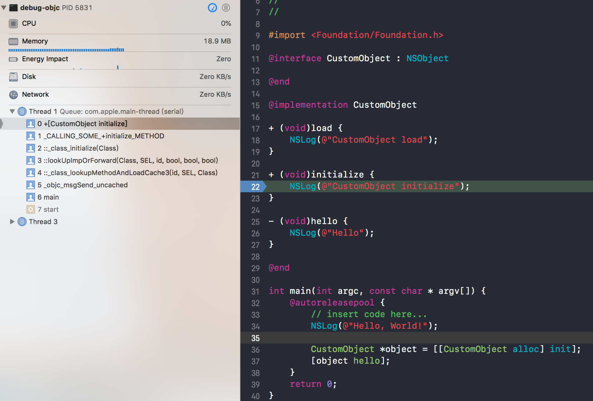

# 概述

上文讲了 Runtime 中的基本数据结构，在此基础上，我们继续来研究类与对象相关的 Runtime 函数。Runtime 有很多的函数可以操作类和对象，类相关的是 class_ 为前缀，对象相关操作是 objc_ 或 object_ 为前缀。

<!--more-->

## NSObject & Runtime

首先从我们非常熟悉的 OC 中的根类 `NSObject` 来入手，看一下 `NSObject` 是怎么实现的。

### load

`+ load` 作为 Objective-C 中的一个方法，与其它方法有很大的不同。它是一个**在整个文件被加载到运行时，在 `main` 函数调用之前被 ObjC 运行时调用的钩子方法**。

#### load 方法调用栈

首先来通过 load 方法的调用栈，分析一下它到底是如何被调用的。

下面是程序的全部代码：


左侧的调用栈很清楚的告诉我们，哪些方法被调用了：

```Objective-C
+[CustomObject load]
call_class_loads()
call_load_methods
load_images
dyld::notifySingle(dyld_image_states, ImageLoader const*)
_dyld_start
```

> dyld 是 the dynamic link editor 的缩写，它是苹果的动态链接器。
> 在系统内核做好程序准备工作之后，交由 dyld 负责余下的工作。

> Q：`load` 方法是如何被调用的？
> A：当 Objective-C 运行时初始化的时候，会通过 `dyld_register_image_state_change_handler` 在每次有新的镜像加入运行时的时候，进行回调。执行 `load_images` 将所有包含 `load` 方法的文件加入列表 `loadable_classes` ，然后从这个列表中找到对应的 `load` 方法的实现，调用 `load` 方法。
> 
> Q：`load` 方法的调用顺序？
> A：`load` 方法的调用顺序有两条规则：父类先于子类调用；类先于分类调用。

### initialize

#### initialize 方法调用栈

我们在 `initialize` 方法中打一个断点，来查看这个方法的调用栈：


```Objective-C
+[CustomObject initialize]
_class_initialize
lookUpImpOrForward
_class_lookupMethodAndLoadCache3
_objc_msgSend_uncached
main
start
```

运行后 log 输出内容：

```shell
CustomObject load
Hello, World!
CustomObject initialize
<CustomObject: 0x100607c70> is init
<CustomObject: 0x100607660> is init
```

> `initialize` 的调用是惰性的，它只会在第一次调用当前类的方法时被调用。
> `initialize` 方法是在 `alloc` 方法之前调用的，`alloc` 的调用导致了前者的执行。
> 与 `load` 不同，`initialize` 方法调用时，所有的类都已经加载到了内存中。
> `initialize` 的运行是线程安全的。
> 会强制父类先发送 `+initialize`，子类会继承父类的 `initialize` 方法。

### alloc & init & new

`+ alloc` 和 `- init` 这一对是 `NSObject` 对象初始化的，整个对象的初始化过程其实只是为一个分配内存空间，并且初始化 `isa_t` 结构体的过程。

#### alloc 的实现

```C
+ (id)alloc {
    return _objc_rootAlloc(self);
}

id _objc_rootAlloc(Class cls)
{
    return callAlloc(cls, false/*checkNil*/, true/*allocWithZone*/);
}

// 中间省略了很多的代码，展示了最常见的执行路径
static id callAlloc(Class cls, bool checkNil, bool allocWithZone=false) {
    id obj = class_createInstance(cls, 0);
    return obj;
}

id class_createInstance(Class cls, size_t extraBytes) {
    return _class_createInstanceFromZone(cls, extraBytes, nil);
}

// 中间省略了很多的代码，展示了最常见的执行路径
static id _class_createInstanceFromZone(Class cls, size_t extraBytes, void *zone, bool cxxConstruct = true, size_t *outAllocatedSize = nil) {
    size_t size = cls->instanceSize(extraBytes);

    id obj = (id)calloc(1, size);
    if (!obj) return nil;
    obj->initInstanceIsa(cls, hasCxxDtor);

    return obj;
}
```

一个对象的初始化过程很符合直觉，只是分配内存空间、然后初始化 `isa_t` 结构体。

#### init 方法

`NSObject` 的 `- init` 方法只是调用了 `_objc_rootInit` 并返回了当前对象。

```C
- (id)init {
    return _objc_rootInit(self);
}

id _objc_rootInit(id obj) {
    return obj;
}
```

#### new

```C
+ (id)new {
    return [callAlloc(self, false/*checkNil*/) init];
}
```

可以看出，`+ new` 方法中也调用了 `callAlloc`，和 `alloc` 差不多，然后再调用 `init`，也就是说 `[NSObject new]` 就相当于 `[[NSObject alloc] init]`。

### isKindOfClass & isMindOfClass

这两个方法很多人都混淆，现在我们看一下里面的具体实现就知道了：

`isKindOfClass` 的实现如下：

```C
- (BOOL)isKindOfClass:(Class)cls {
    for (Class tcls = [self class]; tcls; tcls = tcls->superclass) {
        if (tcls == cls) return YES;
    }
    return NO;
}

- (Class)class {
    return object_getClass(self);
}

Class object_getClass(id obj)
{
    if (obj) return obj->getIsa();
    else return Nil;
}
```

也就是说，如果实例对象的 `isa` 或 `isa->superclass` 或者是 `isa->superclass->superclass`（循环遍历）和传过来的类(Class) 相等，就返回 YES，否则返回 NO。

`isMemberOfClass` 的实现如下：

```C
- (BOOL)isMemberOfClass:(Class)cls {
    return [self class] == cls;
}

- (Class)class {
    return object_getClass(self);
}

Class object_getClass(id obj)
{
    if (obj) return obj->getIsa();
    else return Nil;
}
```

可以看出，`isMemberOfClass` 只是通过比较实例对象的 `isa` 是否和传过来的类(Class) 一样来判断的，比 `isKindOfClass` 的条件更局限。

### isEqual

```C
+ (BOOL)isEqual:(id)obj {
    return obj == (id)self;
}

- (BOOL)isEqual:(id)obj {
    return obj == self;
}
```

直接比较类的地址，或者实例对象的地址是否相等。

### respondsToSelector

```C
- (BOOL)respondsToSelector:(SEL)sel {
    if (!sel) return NO;
    return class_respondsToSelector_inst([self class], sel, self);
}

bool class_respondsToSelector_inst(Class cls, SEL sel, id inst)
{
    IMP imp;

    if (!sel  ||  !cls) return NO;

    // Avoids +initialize because it historically did so.
    // We're not returning a callable IMP anyway.
    imp = lookUpImpOrNil(cls, sel, inst, 
                         NO/*initialize*/, YES/*cache*/, YES/*resolver*/);
    return bool(imp);
}

IMP lookUpImpOrForward(Class cls, SEL sel, id inst, 
                       bool initialize, bool cache, bool resolver)
{
    // Optimistic cache lookup.
    // Try this class's cache.
    // Try this class's method lists.
    // Try superclass caches and method lists. (循环)
    // No implementation found. Try method resolver once.
    // No implementation found, and method resolver didn't help. 
    // Use forwarding.
}
```

查看实例对象是否对传入的方法有响应，其实就是去它的 `isa` 所指向的类或者父类中去查找是否实现了此方法，查找实现的方法 `lookUpImpOrForward` 中省略了代码部分，只列出了注释部分，但是看注释也可以看出它的实现思路，具体实现后面在消息机制部分会详细阐述。

### conformsToProtocol

```C
- (BOOL)conformsToProtocol:(Protocol *)protocol {
    if (!protocol) return NO;
    for (Class tcls = [self class]; tcls; tcls = tcls->superclass) {
        if (class_conformsToProtocol(tcls, protocol)) return YES;
    }
    return NO;
}

BOOL class_conformsToProtocol(Class cls, Protocol *proto_gen)
{
    protocol_t *proto = newprotocol(proto_gen);
    ... // 省略部分代码
    for (const auto& proto_ref : cls->data()->protocols) {
        protocol_t *p = remapProtocol(proto_ref);
        if (p == proto || protocol_conformsToProtocol_nolock(p, proto)) {
            return YES;
        }
    }

    return NO;
}

static bool 
protocol_conformsToProtocol_nolock(protocol_t *self, protocol_t *other)
{
    ... // 省略部分代码
    if (self->protocols) {
        uintptr_t i;
        for (i = 0; i < self->protocols->count; i++) {
            protocol_t *proto = remapProtocol(self->protocols->list[i]);
            if (0 == strcmp(other->mangledName, proto->mangledName)) {
                return YES;
            }
            if (protocol_conformsToProtocol_nolock(proto, other)) {
                return YES;
            }
        }
    }

    return NO;
}
```

`conformsToProtocol` 是个递归查找，查找实例对象的 `isa` 或 `isa->superclass` 或者是 `isa->superclass->superclass`（循环遍历），是否有实现传入的这个 `protocol`，是否实现这个协议，是从 `self->protocols` 里遍历查找。

### performSelector

```C
- (id)performSelector:(SEL)sel {
    if (!sel) [self doesNotRecognizeSelector:sel];
    return ((id(*)(id, SEL))objc_msgSend)(self, sel);
}

- (id)performSelector:(SEL)sel withObject:(id)obj1 withObject:(id)obj2 {
    if (!sel) [self doesNotRecognizeSelector:sel];
    return ((id(*)(id, SEL, id, id))objc_msgSend)(self, sel, obj1, obj2);
}
```

其实就是 `objc_msgSend`，这个后面讲消息机制的时候再具体讲述。 

## Class & Runtime

### 应用实例

先看下这个demo例子，使用了常用的 runtime 中类相关的操作函数，然后具体再讲解：

```C

// CustomClass.h
@interface CustomClass : NSObject <NSCopying, NSCoding>

@property (nonatomic, strong) NSArray *array;
@property (nonatomic, copy) NSString *string;

- (void)method1;
- (void)method2;
+ (void)classMethod1;

@end

// CustomClass.m
@interface CustomClass ()
{
    NSInteger       _instance1;
    NSString    *   _instance2;
}

@property (nonatomic, assign) NSUInteger integer;

- (void)method3WithArg1:(NSInteger)arg1 arg2:(NSString *)arg2;

@end

@implementation CustomClass

+ (void)classMethod1 {
    
}

- (void)method1 {
    NSLog(@"call method method1");
}

- (void)method2 {
    
}

- (void)method3WithArg1:(NSInteger)arg1 arg2:(NSString *)arg2 {
    NSLog(@"arg1 : %ld, arg2 : %@", arg1, arg2);
}

@end

// main.m
int main(int argc, char * argv[]) {
    @autoreleasepool {
        CustomClass *myClass = [[CustomClass alloc] init];
        unsigned int outCount = 0;
        Class cls = myClass.class;
        
        // 类名
        NSLog(@"class name: %s", class_getName(cls));
        NSLog(@"==========================================================");
        
        // 父类
        NSLog(@"super class name: %s", class_getName(class_getSuperclass(cls)));
        NSLog(@"==========================================================");
        
        // 是否是元类
        NSLog(@"MyClass is %@ a meta-class", (class_isMetaClass(cls) ? @"" : @"not"));
        NSLog(@"==========================================================");
        
        Class meta_class = objc_getMetaClass(class_getName(cls));
        NSLog(@"%s's meta-class is %s", class_getName(cls), class_getName(meta_class));
        Class meta_class_super = class_getSuperclass(meta_class);
        NSLog(@"%s's meta-class's super-class is %s", class_getName(cls), class_getName(meta_class_super));
        NSLog(@"==========================================================");
        
        // 变量实例大小
        NSLog(@"instance size: %zu", class_getInstanceSize(cls));
        NSLog(@"==========================================================");
        
        // 成员变量
        Ivar *ivars = class_copyIvarList(cls, &outCount);
        for (int i = 0; i < outCount; i++) {
            Ivar ivar = ivars[i];
            NSLog(@"instance variable's name: %s at index: %d", ivar_getName(ivar), i);
        }
        free(ivars);
        Ivar string = class_getInstanceVariable(cls, "_string");
        if (string != NULL) {
            NSLog(@"instace variable %s", ivar_getName(string));
        }
        NSLog(@"==========================================================");
        
        // 属性操作
        objc_property_t * properties = class_copyPropertyList(cls, &outCount);
        for (int i = 0; i < outCount; i++) {
            objc_property_t property = properties[i];
            NSLog(@"property's name: %s", property_getName(property));
        }
        free(properties);
        objc_property_t array = class_getProperty(cls, "array");
        if (array != NULL) {
            NSLog(@"property %s", property_getName(array));
        }
        NSLog(@"==========================================================");
        
        // 方法操作
        Method *methods = class_copyMethodList(cls, &outCount);
        for (int i = 0; i < outCount; i++) {
            Method method = methods[i];
            NSLog(@"method's signature: %s", method_getName(method));
        }
        free(methods);
        Method method1 = class_getInstanceMethod(cls, @selector(method1));
        if (method1 != NULL) {
            NSLog(@"method %s", method_getName(method1));
        }
        Method classMethod = class_getClassMethod(cls, @selector(classMethod1));
        if (classMethod != NULL) {
            NSLog(@"class method : %s", method_getName(classMethod));
        }
        NSLog(@"MyClass is%@ responsd to selector: method3WithArg1:arg2:", class_respondsToSelector(cls, @selector(method3WithArg1:arg2:)) ? @"" : @" not");
        IMP imp = class_getMethodImplementation(cls, @selector(method1));
        imp();
        NSLog(@"==========================================================");
        
        // 协议
        Protocol * __unsafe_unretained * protocols = class_copyProtocolList(cls, &outCount);
        Protocol * protocol;
        for (int i = 0; i < outCount; i++) {
            protocol = protocols[i];
            NSLog(@"protocol name: %s", protocol_getName(protocol));
        }
        NSLog(@"MyClass is%@ responsed to protocol %s", class_conformsToProtocol(cls, protocol) ? @"" : @" not", protocol_getName(protocol));
        NSLog(@"==========================================================");
        
        // 动态添加类
        NSLog(@"动态添加类==========================================================");
        IMP imp_submethod1 = imp_implementationWithBlock(^(id _self) {
            NSLog(@"run sub method 1");
        });
        Class subClass = objc_allocateClassPair(myClass.class, "SubClass", 0);
        class_addMethod(subClass, @selector(submethod1), (IMP)imp_submethod1, "v@:");
        class_replaceMethod(subClass, @selector(method1), (IMP)imp_submethod1, "v@:");
        class_addIvar(subClass, "_ivar1", sizeof(NSString *), log(sizeof(NSString *)), "i");
        objc_property_attribute_t type = {"T", "@\"NSString\""};
        objc_property_attribute_t ownership = { "C", "" };
        objc_property_attribute_t backingivar = { "V", "_ivar1"};
        objc_property_attribute_t attrs[] = {type, ownership, backingivar};
        class_addProperty(subClass, "property2", attrs, 3);
        objc_registerClassPair(subClass);
        
        id subInstance = [[subClass alloc] init];
        
        // 成员变量
        Ivar *ivars1 = class_copyIvarList(subClass, &outCount);
        for (int i = 0; i < outCount; i++) {
            Ivar ivar = ivars1[i];
            NSLog(@"instance variable's name: %s at index: %d", ivar_getName(ivar), i);
        }
        free(ivars1);
        NSLog(@"==========================================================");
        
        // 属性操作
        objc_property_t *properties1 = class_copyPropertyList(subClass, &outCount);
        for (int i = 0; i < outCount; i++) {
            objc_property_t property = properties1[i];
            NSLog(@"property's name: %s", property_getName(property));
        }
        free(properties1);
        NSLog(@"==========================================================");
        
        [subInstance performSelector:@selector(submethod1)];
        [subInstance performSelector:@selector(method1)];
        NSLog(@"==========================================================");
    }
    return 0;
}
```

打印 log 输出结果为：

```shell
2015-08-08 17:16:32.129952+0800 TestRuntime[30516:9002867] class name: CustomClass
2015-08-08 17:16:32.130589+0800 TestRuntime[30516:9002867] ==========================================================
2015-08-08 17:16:32.130837+0800 TestRuntime[30516:9002867] super class name: NSObject
2015-08-08 17:16:32.131012+0800 TestRuntime[30516:9002867] ==========================================================
2015-08-08 17:16:32.131293+0800 TestRuntime[30516:9002867] MyClass is not a meta-class
2015-08-08 17:16:32.131451+0800 TestRuntime[30516:9002867] ==========================================================
2015-08-08 17:16:32.131564+0800 TestRuntime[30516:9002867] CustomClass's meta-class is CustomClass
2015-08-08 17:16:32.132398+0800 TestRuntime[30516:9002867] CustomClass's meta-class's super-class is NSObject
2015-08-08 17:16:32.132485+0800 TestRuntime[30516:9002867] ==========================================================
2015-08-08 17:16:32.132672+0800 TestRuntime[30516:9002867] instance size: 48
2015-08-08 17:16:32.132816+0800 TestRuntime[30516:9002867] ==========================================================
2015-08-08 17:16:32.132982+0800 TestRuntime[30516:9002867] instance variable's name: _instance1 at index: 0
2015-08-08 17:16:32.133105+0800 TestRuntime[30516:9002867] instance variable's name: _instance2 at index: 1
2015-08-08 17:16:32.133262+0800 TestRuntime[30516:9002867] instance variable's name: _array at index: 2
2015-08-08 17:16:32.133437+0800 TestRuntime[30516:9002867] instance variable's name: _string at index: 3
2015-08-08 17:16:32.133714+0800 TestRuntime[30516:9002867] instance variable's name: _integer at index: 4
2015-08-08 17:16:32.133835+0800 TestRuntime[30516:9002867] instace variable _string
2015-08-08 17:16:32.134005+0800 TestRuntime[30516:9002867] ==========================================================
2015-08-08 17:16:32.134140+0800 TestRuntime[30516:9002867] property's name: integer
2015-08-08 17:16:32.134251+0800 TestRuntime[30516:9002867] property's name: array
2015-08-08 17:16:32.134399+0800 TestRuntime[30516:9002867] property's name: string
2015-08-08 17:16:32.134561+0800 TestRuntime[30516:9002867] property array
2015-08-08 17:16:32.134712+0800 TestRuntime[30516:9002867] ==========================================================
2015-08-08 17:16:32.134883+0800 TestRuntime[30516:9002867] method's signature: method1
2015-08-08 17:16:32.134989+0800 TestRuntime[30516:9002867] method's signature: method3WithArg1:arg2:
2015-08-08 17:16:32.135134+0800 TestRuntime[30516:9002867] method's signature: method2
2015-08-08 17:16:32.135314+0800 TestRuntime[30516:9002867] method's signature: integer
2015-08-08 17:16:32.135388+0800 TestRuntime[30516:9002867] method's signature: setInteger:
2015-08-08 17:16:32.135492+0800 TestRuntime[30516:9002867] method's signature: setArray:
2015-08-08 17:16:32.135602+0800 TestRuntime[30516:9002867] method's signature: .cxx_destruct
2015-08-08 17:16:32.135774+0800 TestRuntime[30516:9002867] method's signature: setString:
2015-08-08 17:16:32.135892+0800 TestRuntime[30516:9002867] method's signature: array
2015-08-08 17:16:32.136003+0800 TestRuntime[30516:9002867] method's signature: string
2015-08-08 17:16:32.136167+0800 TestRuntime[30516:9002867] method method1
2015-08-08 17:16:32.136317+0800 TestRuntime[30516:9002867] class method : classMethod1
2015-08-08 17:16:32.136436+0800 TestRuntime[30516:9002867] MyClass is responsd to selector: method3WithArg1:arg2:
2015-08-08 17:16:32.136537+0800 TestRuntime[30516:9002867] call method method1
2015-08-08 17:16:32.136635+0800 TestRuntime[30516:9002867] ==========================================================
2015-08-08 17:16:32.136792+0800 TestRuntime[30516:9002867] protocol name: NSCopying
2015-08-08 17:16:32.136866+0800 TestRuntime[30516:9002867] protocol name: NSCoding
2015-08-08 17:16:32.137016+0800 TestRuntime[30516:9002867] MyClass is responsed to protocol NSCoding
2015-08-08 17:16:32.137138+0800 TestRuntime[30516:9002867] ==========================================================
2015-08-08 17:16:32.137442+0800 TestRuntime[30516:9002867] 动态添加类==========================================================
2015-08-08 17:16:32.137793+0800 TestRuntime[30516:9002867] instance variable's name: _ivar1 at index: 0
2015-08-08 17:16:32.137909+0800 TestRuntime[30516:9002867] ==========================================================
2015-08-08 17:16:32.138061+0800 TestRuntime[30516:9002867] property's name: property2
2015-08-08 17:16:32.138182+0800 TestRuntime[30516:9002867] ==========================================================
2015-08-08 17:16:32.138269+0800 TestRuntime[30516:9002867] run sub method 1
2015-08-08 17:16:32.138419+0800 TestRuntime[30516:9002867] run sub method 1
2015-08-08 17:16:32.138528+0800 TestRuntime[30516:9002867] ==========================================================
```

对照上面的例子，我们一一介绍：

### name

```C
// 获取类的类名
const char *class_getName(Class cls);
```

### super_class 和 meta-class

```C
// 获取类的父类
Class class_getSuperclass(Class cls);
// 判断给定的Class是否是一个meta class
BOOL class_isMetaClass(Class cls);
```

### instance_size

```C
// 获取实例大小
size_t class_getInstanceSize(Class cls);
```

### 成员变量(ivars)及属性

```C
//成员变量操作函数
// 获取类中指定名称实例成员变量的信息
Ivar class_getInstanceVariable(Class cls, const char *name);
// 获取类成员变量的信息
Ivar class_getClassVariable(Class cls, const char *name);
// 添加成员变量
BOOL class_addIvar(Class cls, const char *name, size_t size, uint8_t alignment, const char *types); //这个只能够向在runtime时创建的类添加成员变量
// 获取整个成员变量列表
Ivar * class_copyIvarList(Class cls, unsigned int *outCount); //必须使用free()来释放这个数组

//属性操作函数
// 获取类中指定名称实例成员变量的信息
Ivar class_getInstanceVariable(Class cls, const char *name);
// 获取类成员变量的信息
Ivar class_getClassVariable(Class cls, const char *name);
// 添加成员变量
BOOL class_addIvar(Class cls, const char *name, size_t size, uint8_t alignment, const char *types);
// 获取整个成员变量列表
Ivar * class_copyIvarList(Class cls, unsigned int *outCount);
```

### methodLists

```C
// 添加方法
BOOL class_addMethod(Class cls, SEL name, IMP imp, const char *types); //和成员变量不同的是可以为类动态添加方法。如果有同名会返回NO，修改的话需要使用method_setImplementation
// 获取实例方法
Method class_getInstanceMethod(Class cls, SEL name);
// 获取类方法
Method class_getClassMethod(Class cls, SEL name);
// 获取所有方法的数组
Method * class_copyMethodList(Class cls, unsigned int *outCount);
// 替代方法的实现
IMP class_replaceMethod(Class cls, SEL name, IMP imp, const char *types);
// 返回方法的具体实现
IMP class_getMethodImplementation(Class cls, SEL name);
IMP class_getMethodImplementation_stret(Class cls, SEL name);
// 类实例是否响应指定的selector
BOOL class_respondsToSelector(Class cls, SEL sel);
objc_protocol_list
// 添加协议
BOOL class_addProtocol(Class cls, Protocol *protocol);
// 返回类是否实现指定的协议
BOOL class_conformsToProtocol(Class cls, Protocol *protocol);
// 返回类实现的协议列表
Protocol * class_copyProtocolList(Class cls, unsigned int *outCount);
```

### 动态创建类

```C
// 创建一个新类和元类
Class objc_allocateClassPair(Class superclass, const char *name, size_t extraBytes); //如果创建的是root class，则superclass为Nil。extraBytes通常为0
// 销毁一个类及其相关联的类
void objc_disposeClassPair(Class cls); //在运行中还存在或存在子类实例，就不能够调用这个。
// 在应用中注册由objc_allocateClassPair创建的类
void objc_registerClassPair(Class cls); //创建了新类后，然后使用class_addMethod，class_addIvar函数为新类添加方法，实例变量和属性后再调用这个来注册类，再之后就能够用了。
```

## Meta Class

上面我们介绍了怎么在运行时创建一个类：
1、为 `class pair` 创建存储空间 (`objc_allocateClassPair`)
2、为这个类添加所需的 methods 和 ivars
3、注册这个类 (`objc_registerClassPair`)
 
这里的 `class pair` 对，其中之一是返回的那个 `class`，那另一个就是 `meta-class`。

之前我们说过，类的 `isa` 指针指向了它的 `meta-class`，向一个类发送消息时，会在这个类的 `meta-class`的方法列表中查找。

而 `meta-class` 也是一个类，`meta-class` 的 `isa` 指向基类的 `meta-class`，以此作为它的所属类。也就是说任何 `NSObject` 继承体系下的 `meta-class` 都使用 `NSObject` 的 `meta-class` 作为自己的所属类，而基类的 `meta-class` 的 `isa` 指针指向它自己，这样就形成了一个完美的闭环。从上节中的 log 日志也可以看出。


## Object & Runtime

这些函数是针对创建的实例对象的一系列操作函数。

### 整个对象操作的函数

```C
// 返回指定对象的一份拷贝
id object_copy(id obj, size_t size);
// 释放指定对象占用的内存
id object_dispose(id obj);
```

> 备注：在ARC下不可用。

### 对象实例变量进行操作的函数

```C
// 修改类实例的实例变量的值
Ivar object_setInstanceVariable(id obj, const char *name, void *value);
// 获取对象实例变量的值
Ivar object_getInstanceVariable(id obj, const char *name, void **outValue);
// 返回指向给定对象分配的任何额外字节的指针
void * object_getIndexedIvars(id obj);
// 返回对象中实例变量的值
id object_getIvar(id obj, Ivar ivar);
// 设置对象中实例变量的值
void object_setIvar ( id obj, Ivar ivar, id value );
```

> 备注：在ARC下不可用。
> 1.`object_setInstanceVariable` 内部实现是先通过 `class_getInstanceVariable` 获取到对应的 `Ivar`，然后调用 `object_setIvar` 设置 `Ivar` 的值。
> 2.`object_getInstanceVariable` 内部实现是先通过 `class_getInstanceVariable` 获取 `Ivar`，然后调用`object_getIvar` 获取 `Ivar` 的值，并把值赋值给 `outValue`，然后返回Ivar。
> 3.在已经知道 `Ivar` 的情况下，`object_getIvar` 比 `object_getInstanceVariable` 更快。相同情况下，`object_setIvar` 也比 `object_setInstanceVariable` 快。

### 对对象类操作

```C
// 返回给定对象的类名
const char * object_getClassName(id obj);
// 返回对象的类
Class object_getClass(id obj);
// 设置对象的类
Class object_setClass(id obj, Class cls);
```

### 动态创建对象

```C
// 创建类实例
id class_createInstance(Class cls, size_t extraBytes); //会在heap里给类分配内存。这个方法和+alloc方法类似。
// 在指定位置创建类实例
id objc_constructInstance(Class cls, void *bytes); 
// 销毁类实例
void * objc_destructInstance(id obj); //不会释放移除任何相关引用
```

### 关联对象

在分类中 `@property` 并不会自动生成实例变量以及存取方法，所以一般使用关联对象为已经存在的类添加关“属性”。

向下面这样：

```Objective-C
#import "CustomClass+Category.h"
#import <objc/runtime.h>

@implementation CustomClass (Category)

- (NSString *)categoryProperty {
    return objc_getAssociatedObject(self, _cmd);
}

- (void)setCategoryProperty:(NSString *)categoryProperty {
    objc_setAssociatedObject(self, @selector(categoryProperty), categoryProperty, OBJC_ASSOCIATION_RETAIN_NONATOMIC);
}

@end
```

#### objc_setAssociatedObject

```C
void objc_setAssociatedObject(id object, const void *key, id value, objc_AssociationPolicy policy) {
    _object_set_associative_reference(object, (void *)key, value, policy);
}

void _object_set_associative_reference(id object, void *key, id value, uintptr_t policy) {
    // retain the new value (if any) outside the lock.
    ObjcAssociation old_association(0, nil);
    id new_value = value ? acquireValue(value, policy) : nil;
    {
        AssociationsManager manager;
        AssociationsHashMap &associations(manager.associations());
        disguised_ptr_t disguised_object = DISGUISE(object);
        if (new_value) {
            // break any existing association.
            AssociationsHashMap::iterator i = associations.find(disguised_object);
            if (i != associations.end()) {
                // secondary table exists
                ObjectAssociationMap *refs = i->second;
                ObjectAssociationMap::iterator j = refs->find(key);
                if (j != refs->end()) {
                    old_association = j->second;
                    j->second = ObjcAssociation(policy, new_value);
                } else {
                    (*refs)[key] = ObjcAssociation(policy, new_value);
                }
            } else {
                // create the new association (first time).
                ObjectAssociationMap *refs = new ObjectAssociationMap;
                associations[disguised_object] = refs;
                (*refs)[key] = ObjcAssociation(policy, new_value);
                object->setHasAssociatedObjects();
            }
        } else {
            // setting the association to nil breaks the association.
            AssociationsHashMap::iterator i = associations.find(disguised_object);
            if (i !=  associations.end()) {
                ObjectAssociationMap *refs = i->second;
                ObjectAssociationMap::iterator j = refs->find(key);
                if (j != refs->end()) {
                    old_association = j->second;
                    refs->erase(j);
                }
            }
        }
    }
    // release the old value (outside of the lock).
    if (old_association.hasValue()) ReleaseValue()(old_association);
}
```

#### objc_getAssociatedObject

```C
id objc_getAssociatedObject(id object, const void *key) {
    return _object_get_associative_reference(object, (void *)key);
}

id _object_get_associative_reference(id object, void *key) {
    id value = nil;
    uintptr_t policy = OBJC_ASSOCIATION_ASSIGN;
    {
        AssociationsManager manager;
        AssociationsHashMap &associations(manager.associations());
        disguised_ptr_t disguised_object = DISGUISE(object);
        AssociationsHashMap::iterator i = associations.find(disguised_object);
        if (i != associations.end()) {
            ObjectAssociationMap *refs = i->second;
            ObjectAssociationMap::iterator j = refs->find(key);
            if (j != refs->end()) {
                ObjcAssociation &entry = j->second;
                value = entry.value();
                policy = entry.policy();
                if (policy & OBJC_ASSOCIATION_GETTER_RETAIN) {
                    objc_retain(value);
                }
            }
        }
    }
    if (value && (policy & OBJC_ASSOCIATION_GETTER_AUTORELEASE)) {
        objc_autorelease(value);
    }
    return value;
}
```

#### objc_removeAssociatedObjects

```C
void objc_removeAssociatedObjects(id object) 
{
    if (object && object->hasAssociatedObjects()) {
        _object_remove_assocations(object);
    }
}

void _object_remove_assocations(id object) {
    vector< ObjcAssociation,ObjcAllocator<ObjcAssociation> > elements;
    {
        AssociationsManager manager;
        AssociationsHashMap &associations(manager.associations());
        if (associations.size() == 0) return;
        disguised_ptr_t disguised_object = DISGUISE(object);
        AssociationsHashMap::iterator i = associations.find(disguised_object);
        if (i != associations.end()) {
            // copy all of the associations that need to be removed.
            ObjectAssociationMap *refs = i->second;
            for (ObjectAssociationMap::iterator j = refs->begin(), end = refs->end(); j != end; ++j) {
                elements.push_back(j->second);
            }
            // remove the secondary table.
            delete refs;
            associations.erase(i);
        }
    }
    // the calls to releaseValue() happen outside of the lock.
    for_each(elements.begin(), elements.end(), ReleaseValue());
}
```

#### 总结

关联对象其实就是 `ObjcAssociation` 对象。
关联对象由 `AssociationsManager` 管理并在 `AssociationsHashMap` 存储。
对象的指针以及其对应 `ObjectAssociationMap` 以键值对的形式存储在 `AssociationsHashMap` 中。
`ObjectAssociationMap` 则是用于存储关联对象的数据结构。
每一个对象都有一个标记位 `has_assoc` 指示对象是否含有关联对象。

## 参考

https://draveness.me/load
https://draveness.me/initialize
https://draveness.me/object-init
https://draveness.me/ao
https://ming1016.github.io/2015/04/01/objc-runtime/

## 修改记录

2016.04.30
2016.08.10


