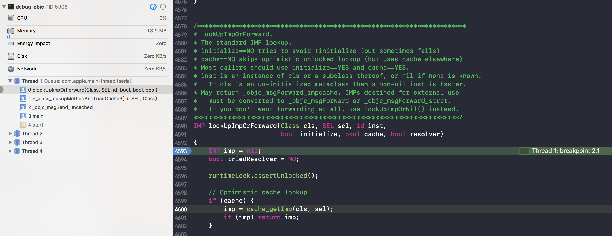
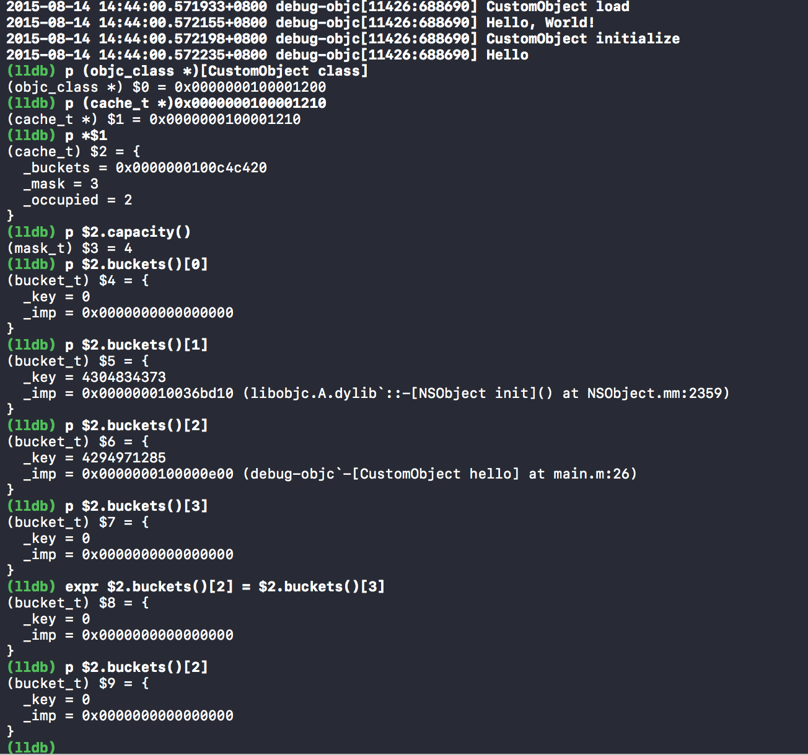
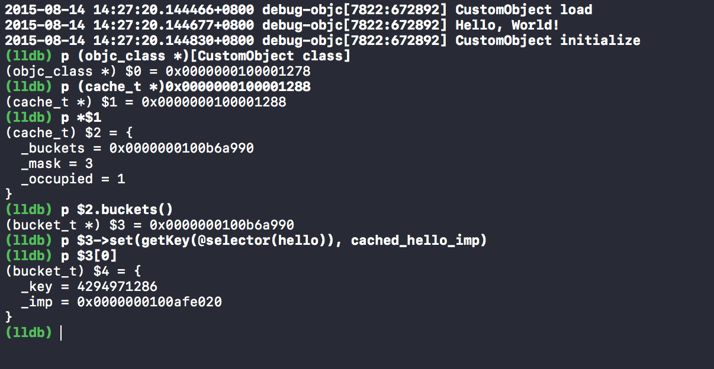

# 概述

Objective-C 最大的特色是承自 Smalltalk 的消息传递模型，Objective-C 里，对象互相调用方法，就是对象之间互相传递消息。

C++ 里类别与方法的关系严格清楚，一个方法必定属于一个类别，而且在编译时（compile time）就已经紧密绑定，不可能调用一个类别里不存在的方法。但在Objective-C，类别与消息的关系比较松散，调用方法视为对对象发送消息，所有方法都被视为对消息的回应。所有消息处理直到运行时（runtime）才会动态决定，并交由类别自行决定如何处理收到的消息。也就是说，一个类别不保证一定会回应收到的消息，如果类别收到了一个无法处理的消息，程序只会抛出异常，不会出错或崩溃。

<!--more-->

# 消息机制

调用编译阶段并不会去绑定执行的函数，只有在运行的时候才回去对象中查找方法，接受方法的类中有个方法列表，如果能找到方法就调用，找不到的话就回去父类中查找。

## 消息相关的数据结构

在第一篇讲 Runtime 基本数据结构的时候，我们了解了与方法相关的数据结构，再来回忆一下：

```C
/// An opaque type that represents a method in a class definition.
typedef struct objc_method *Method;

struct objc_method {
    SEL method_name                                          OBJC2_UNAVAILABLE;
    char *method_types                                       OBJC2_UNAVAILABLE;
    IMP method_imp                                           OBJC2_UNAVAILABLE;
}

/// An opaque type that represents a method selector.
typedef struct objc_selector     *SEL;

/// A pointer to the function of a method implementation. 
typedef id (*IMP)(id, SEL, ...); 
```

## objc_msgSend

所有的 Objective-C 方法调用都是基于 Objective-C Runtime 进行的。 比如最简单的方法调用：

```Objective-C
[object hello];
```

从 Objective-C Runtime 的角度来说，这个代码实际上是在发送一个消息，编译器实际上会将它转换成这样一个函数调用：

```C
objc_msgSend(object, @selector(hello))
```

我们在 Objective-C 中所有通过一对方括号所进行的方法调用，其实都是通过 Objective-C Runtime 的 `objc_msgSend` 函数发送的一个消息传递。

Objective-C 中 `objc_msgSend` 的实现并没有开源，它只存在于 `message.h` 这个头文件中。

```C
/** 
 * Sends a message with a simple return value to an instance of a class.
 * 
 * @param self A pointer to the instance of the class that is to receive the message.
 * @param op The selector of the method that handles the message.
 * @param ... 
 *   A variable argument list containing the arguments to the method.
 * 
 * @return The return value of the method.
 * 
 * @note When it encounters a method call, the compiler generates a call to one of the
 *  functions \c objc_msgSend, \c objc_msgSend_stret, \c objc_msgSendSuper, or \c objc_msgSendSuper_stret.
 *  Messages sent to an object’s superclass (using the \c super keyword) are sent using \c objc_msgSendSuper; 
 *  other messages are sent using \c objc_msgSend. Methods that have data structures as return values
 *  are sent using \c objc_msgSendSuper_stret and \c objc_msgSend_stret.
 */
OBJC_EXPORT id objc_msgSend(id self, SEL op, ...)
    __OSX_AVAILABLE_STARTING(__MAC_10_0, __IPHONE_2_0);
```

在这个头文件的注释中对消息发送的一系列方法解释得非常清楚：
当编译器遇到一个方法调用时，它会将方法的调用翻译成以下函数中的一个 `objc_msgSend`、`objc_msgSend_stret`、`objc_msgSendSuper` 和 `objc_msgSendSuper_stret`。 发送给对象的父类的消息会使用 `objc_msgSendSuper`，有数据结构作为返回值的方法会使用 `objc_msgSendSuper_stret` 或 `objc_msgSend_stret`，其它的消息都是使用 `objc_msgSend` 发送的。

对 `objc_msgSend` 解析总共分两个步骤，我们会向 `CustomObject` 的实例发送两次 `hello` 消息，分别模拟无缓存和有缓存两种情况下的调用栈。

### 无缓存

`objc_msgSend` 的调用栈，可以通过这个[视频](https://www.youtube.com/watch?v=bCdjdI4VhwQ&feature=youtu.be)里打断点查看。我们来看下，在调用 `[object hello]` 方法时的调用栈（`cls`, `sel` 值分别是 `CustomObject`, `"hello"`，说明这就是当调用 `hello` 方法时执行的函数）：



左侧的调用栈是这样的：

```Shell
lookUpImpOrForward
_class_lookupMethodAndLoadCache3
objc_msgSend_uncached
main
start
```

`obj_msgSend` 的实际动作就是：找到这个函数指针，然后调用它。而找到函数指针的方法就是 `lookUpImpOrForward`。

`lookUpImpOrForward` 并不是 `objc_msgSend` 直接调用的，而是通过 `_class_lookupMethodAndLoadCache3` 方法：

```C
IMP _class_lookupMethodAndLoadCache3(id obj, SEL sel, Class cls)
{
    return lookUpImpOrForward(cls, sel, obj,
                              YES/*initialize*/, NO/*cache*/, YES/*resolver*/);
}
```

`lookUpImpOrForward` 实现的方法的查找，分以下几个部分：

#### 无锁的缓存查找

下面是在没有加锁的时候对缓存进行查找，提高缓存使用的性能：

```C
runtimeLock.assertUnlocked();

// Optimistic cache lookup
if (cache) {
   imp = cache_getImp(cls, sel);
   if (imp) return imp;
}
```

不过因为 `_class_lookupMethodAndLoadCache3` 传入的 cache = NO，所以这里会直接跳过 if 中代码的执行。

#### 类的实现和初始化

在 Objective-C 运行时初始化的过程中，如果类没有实现（isRealized），则执行 `realizeClass` 方法实现类，如果没有初始化（isInitialized），则通过 `_class_initialize` 方法初始化，会调用类的 `initialize` 方法。

```C
if (!cls->isRealized()) {
    rwlock_writer_t lock(runtimeLock);
    realizeClass(cls);
}

if (initialize  &&  !cls->isInitialized()) {
    _class_initialize (_class_getNonMetaClass(cls, inst));
}
```

#### 加锁

加锁的主要目的是，保证方法查找以及缓存填充（cache-fill）的原子性，保证在运行以下代码时不会有新方法添加导致缓存被冲洗（flush）。

```C
runtimeLock.read();
```

#### 在当前类中查找实现

在当前类中查找，先调用了 `cache_getImp` 从类的缓存中查找，如果缓存中查找不到，（第一次调用 hello 方法），则从类的方法列表中寻找方法的实现 `getMethodNoSuper_nolock`，找到后通过 `log_and_fill_cache` 将它加入类的缓存中：

```C
// Try this class's cache.
imp = cache_getImp(cls, sel);
if (imp) goto done;

// Try this class's method lists.
{
    Method meth = getMethodNoSuper_nolock(cls, sel);
    if (meth) {
        log_and_fill_cache(cls, meth->imp, sel, inst, cls);
        imp = meth->imp;
        goto done;
    }
}
```

#### 在父类中寻找实现

如果在当前类中找不到方法的实现，则会去父类查找，这一部分与上面的实现基本上相同，只是多了一个循环用来判断根类：

```C
// Try superclass caches and method lists.
{
   unsigned attempts = unreasonableClassCount();
   for (Class curClass = cls->superclass;
        curClass != nil;
        curClass = curClass->superclass)
   {
       // Halt if there is a cycle in the superclass chain.
       if (--attempts == 0) {
           _objc_fatal("Memory corruption in class list.");
       }
       
       // Superclass cache.
       imp = cache_getImp(curClass, sel);
       if (imp) {
           if (imp != (IMP)_objc_msgForward_impcache) {
               // Found the method in a superclass. Cache it in this class.
               log_and_fill_cache(cls, imp, sel, inst, curClass);
               goto done;
           }
           else {
               // Found a forward:: entry in a superclass.
               // Stop searching, but don't cache yet; call method 
               // resolver for this class first.
               break;
           }
       }
       
       // Superclass method list.
       Method meth = getMethodNoSuper_nolock(curClass, sel);
       if (meth) {
           log_and_fill_cache(cls, meth->imp, sel, inst, curClass);
           imp = meth->imp;
           goto done;
       }
   }
}
```

与当前类寻找实现的区别是：在父类中寻找到的 `_objc_msgForward_impcache` 实现会交给当前类来处理。

#### 方法决议

如果在当前类和父类中都没有找到方法实现，就进入了方法决议（method resolve）的过程：

```C
// No implementation found. Try method resolver once.
if (resolver  &&  !triedResolver) {
   runtimeLock.unlockRead();
   _class_resolveMethod(cls, sel, inst);
   runtimeLock.read();
   // Don't cache the result; we don't hold the lock so it may have 
   // changed already. Re-do the search from scratch instead.
   triedResolver = YES;
   goto retry;
}
```

内部实现：

```C
void _class_resolveMethod(Class cls, SEL sel, id inst)
{
    if (! cls->isMetaClass()) {
        // try [cls resolveInstanceMethod:sel]
        _class_resolveInstanceMethod(cls, sel, inst);
    } 
    else {
        // try [nonMetaClass resolveClassMethod:sel]
        // and [cls resolveInstanceMethod:sel]
        _class_resolveClassMethod(cls, sel, inst);
        if (!lookUpImpOrNil(cls, sel, inst, 
                            NO/*initialize*/, YES/*cache*/, NO/*resolver*/)) 
        {
            _class_resolveInstanceMethod(cls, sel, inst);
        }
    }
}

static void _class_resolveInstanceMethod(Class cls, SEL sel, id inst) {
    if (! lookUpImpOrNil(cls->ISA(), SEL_resolveInstanceMethod, cls,
                         NO/*initialize*/, YES/*cache*/, NO/*resolver*/)) {
        // 没有找到 resolveInstanceMethod: 方法，直接返回。
        return;
    }

    BOOL (*msg)(Class, SEL, SEL) = (__typeof__(msg))objc_msgSend;
    bool resolved = msg(cls, SEL_resolveInstanceMethod, sel);

    // 缓存结果，以防止下次在调用 resolveInstanceMethod: 方法影响性能。
    IMP imp = lookUpImpOrNil(cls, sel, inst,
                             NO/*initialize*/, YES/*cache*/, NO/*resolver*/);
}
```

这两个方法的实现其实就是判断当前类是否实现了 `resolveInstanceMethod:` 或者 `resolveClassMethod:` 方法，然后用 `objc_msgSend` 执行上述方法，并传入需要决议的选择子。

在执行了 `resolveInstanceMethod:` 之后，会跳转到 `retry` 标签，重新执行查找方法实现的流程，只不过不会再调用 `resolveInstanceMethod:` 方法了（将 `triedResolver` 标记为 YES）。

#### 消息转发

在缓存、当前类、父类以及 `resolveInstanceMethod:` 都没有解决实现查找的问题时，Objective-C 还为我们提供了最后一次翻身的机会，进行方法转发：

```C
// No implementation found, and method resolver didn't help. 
// Use forwarding.
imp = (IMP)_objc_msgForward_impcache;
cache_fill(cls, sel, imp, inst);
```

返回实现 `_objc_msgForward_impcache`，然后加入缓存。

#### 解锁、返回实现

```C
done:
    runtimeLock.unlockRead();

return imp;
```

上面查找方法的过程中，一旦找到方法的实现，就会跳转到 `done` 标签进行解锁，然后返回方法实现。

#### 实例

根据上面截图中 demo 中的示例，由于 `CustomObject` 实现了方法 `hello`，当我们调用 `[object hello]` 时，虽然缓存没有命中，但是在当前类的方法列表中找到了 `hello` 方法的实现，调用了该方法，这样就结束了整个方法第一次的调用过程。

### 有缓存

如果使用对应的选择子时，缓存命中了，那么情况就大不相同了，我们修改主程序中的代码：

```C
int main(int argc, const char * argv[]) {
    @autoreleasepool {
        // insert code here...
        NSLog(@"Hello, World!");
        
        CustomObject *object = [[CustomObject alloc] init];
        [object hello];
        [object hello];
    }
    return 0;
}
```

在第二次调用 `hello` 方法时，同第一次一样加断点，发现第二次 `objc_msgSend` 并没有走 `lookupImpOrForward` 这个方法，而是直接调用了 `hello` 方法，结束了。

为了验证有缓存时，`objc_msgSend` 是否真的访问了类中的缓存来加速实现寻找的过程，我们进行了两种实验：

> 一个重要的问题：`objc_class *` 的地址偏移 0x10，可以得到成员 `cache` 的地址

#### 清除缓存

在执行第二个 `hello` 方法前，将其中 `hello` 的缓存清空：



这样 `CustomObject` 中就不存在 `hello` 方法对应实现的缓存了。然后继续运行程序，果然像第一次调用 `hello` 一样，会再次进入 `lookupImpOrForward` 方法。

#### 添加伪缓存

修改代码为：

```C
int main(int argc, const char * argv[]) {
    @autoreleasepool {
        // insert code here...
        NSLog(@"Hello, World!");
        
        __unused IMP cached_hello_imp = imp_implementationWithBlock(^() {
            NSLog(@"Cached Hello");
        });
        CustomObject *object = [[CustomObject alloc] init];
        [object hello];
    }
    return 0;
}
```

在第一个 `hello` 方法调用之前，打断点将实现加入缓存：



我们看到添加缓存后，打印出的 `_imp` 的地址和上面我们定义的 `cached_hello_imp` 的地址一样，执行代码后，输出了 `Cached Hello`，可见在 `objc_msgSend` 的消息发送链路中，使用错误的缓存实现 `cached_hello_imp` 拦截了实现的查找，没有再调用 `lookupImpOrForward` 进行方法查找，打印出了 `Cached Hello`。

由此可以推定，`objc_msgSend` 在实现中确实检查了缓存，如果没有缓存会调用 `lookupImpOrForward` 进行方法查找。

# 总结

看了大神 Draveness 的[从源代码看 ObjC 中消息的发送](https://draveness.me/message)，对 OC 中的消息机制介绍的很透彻。参考原文对 `objc_msgSend` 部分进行了深入的学习，感谢大神。（2016.5.15）

# 参考

https://draveness.me/message

