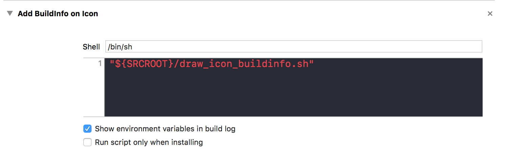
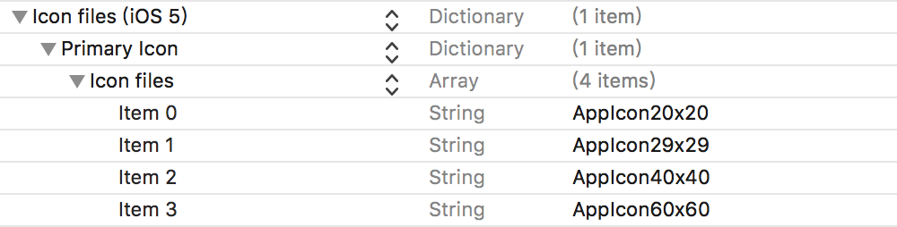
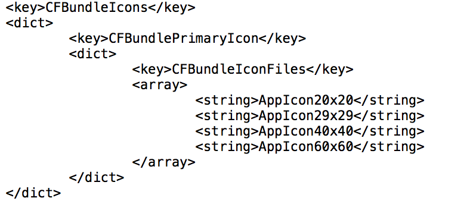

# 前言

iOS 分支开发迭代过程中，测试经常需要装不同分支不同版本的包，有时候测试发现了 BUG 后，会突然忘了自己下的是 CI 上的哪一个包？这时候，我们可以把打包的 build 信息打印在 AppIcon 上，这样只需要根据 Icon 上的 build 信息就一目了然了。

<!--more-->

# ImageMagick

使用 ImageMagick 可以创建、编辑、合成或转换图片。它可以读和写各种格式的图像（超过 200 种格式）包括 PNG、JPEG、JPEG - 2000、GIF、TIFF、DPX、EXR、WebP、Postscript、PDF、SVG。ImageMagick 可以调整、翻转、镜像、旋转、扭曲、剪切和转换图像、图像色彩调整，适用于各种特殊效果,或绘制文本、线、多边形、椭圆和贝塞尔曲线。

通过 shell command 就可以轻易使用以上功能。

# Build Phases

Build Phases 代表着将代码构建为一个可执行文件的规则。它描述了 build 过程中必须执行的不同任务。

## 定制Build Phases

你可以在 build phases 中添加运行自定义脚本，就像 CocoaPods 使用的一样，来做额外的工作。当然也可以添加一些资源的拷贝任务，当你需要将某些确定的资源拷贝到制定的 target 目录中，这非常有用。
另外你可以通过定制 build phase 来添加带有水印(包括版本号和commit hash)的 app icon。只需要在 build phase 中添加一个 Run Script.

在工程 `Target` -> `Build Phases` 中新建一个 `Run Script`，我们可以给它起名 `Add BuildInfo on Icon`。




创建脚本 draw_icon_buildinfo.sh

## 写加水印的脚本

1.判断执行 Build 的机器是否安装了 ImageMagic

```
convertPath=`which convert`
# 判断 convertPath 文件是否存在
if [ ! -f ${convertPath}]; then
echo "==============
WARNING: 你需要先安装 ImageMagick！！！！:
brew install imagemagick
=============="
exit 0;
fi
```

2.判断 Release 包不执行以下操作

```
if [ ${CONFIGURATION} = "Release" ]; then
exit 0;
fi
```

3.获取 commit、branch、version 等信息

```
version=`/usr/libexec/PlistBuddy -c "Print CFBundleShortVersionString" "${CONFIGURATION_BUILD_DIR}/${INFOPLIST_PATH}"`
build_num=`/usr/libexec/PlistBuddy -c "Print SinaNewsBuildVersion" "${CONFIGURATION_BUILD_DIR}/${INFOPLIST_PATH}"`
if [[ ${build_num} == "" ]]; then
    build_num=`date +"%Y%m%d%H%M"`
    echo "Use Xcode building, build time ${build_num}"
fi
commit=`git rev-parse --short HEAD`
branch=$(git rev-parse --abbrev-ref HEAD)
caption="${version}\n${build_num}\n${branch}"
echo "caption : ${caption}"
```

4.找Icon图片

在编译后的 info.plist 中，可以看到：



通过脚本输出的结果为：

```
/usr/libexec/PlistBuddy -c "Print CFBundleIcons:CFBundlePrimaryIcon:CFBundleIconFiles" "${CONFIGURATION_BUILD_DIR}/${INFOPLIST_PATH}"
```

```
Array {
    AppIcon20x20
    AppIcon29x29
    AppIcon40x40
    AppIcon60x60
}
```
所以真实的 icon 个数为:

```
real_icon_index=$((${icon_count} - 2))
```

根据数量循环，对找到的每个 Icon 执行加水印的操作：

```
i=0
while [  $i -lt $real_icon_index ]; do
  icon=`/usr/libexec/PlistBuddy -c "Print CFBundleIcons:CFBundlePrimaryIcon:CFBundleIconFiles:$i" "${CONFIGURATION_BUILD_DIR}/${INFOPLIST_PATH}"`

  echo "icon: ${icon}"

  if [[ $icon == *.png ]] || [[ $icon == *.PNG ]]
  then
    processIcon $icon
  else
    processIcon "${icon}.png"
    processIcon "${icon}@2x.png"
    processIcon "${icon}@3x.png"

    processIcon "${icon}~ipad.png"
    processIcon "${icon}@2x~ipad.png"
  fi
  let i=i+1
done
```

5.对找到的图片 Icon 加水印处理

```
function processIcon() {
    base_file=$1

    cd "${CONFIGURATION_BUILD_DIR}/${UNLOCALIZED_RESOURCES_FOLDER_PATH}"
    base_path=`find . -name ${base_file}`

    real_path=$( abspath "${base_path}" )
    echo "base path ${real_path}"

    # 验证存在性
    if [[ ! -f ${base_path} || -z ${base_path} ]]; then
      return;
    fi

    # TODO: if they are the same we need to fix it by introducing temp
    target_file=`basename $base_path`
    target_path="${CONFIGURATION_BUILD_DIR}/${UNLOCALIZED_RESOURCES_FOLDER_PATH}/${target_file}"

    base_tmp_normalizedFileName="${base_file%.*}-normalized.${base_file##*.}"
    base_tmp_path=`dirname $base_path`
    base_tmp_normalizedFilePath="${base_tmp_path}/${base_tmp_normalizedFileName}"

    stored_original_file="${base_tmp_normalizedFilePath}-tmp"
    if [[ -f ${stored_original_file} ]]; then
      echo "found previous file at path ${stored_original_file}, using it as base"
      mv "${stored_original_file}" "${base_path}"
    fi

    if [ $CONFIGURATION = "Release" ]; then
      cp "${base_path}" "$target_path"
      return 0;
    fi

    echo "Reverting optimized PNG to normal"
    # Normalize
    echo "xcrun -sdk iphoneos pngcrush -revert-iphone-optimizations -q ${base_path} ${base_tmp_normalizedFilePath}"
    xcrun -sdk iphoneos pngcrush -revert-iphone-optimizations -q "${base_path}" "${base_tmp_normalizedFilePath}"

    # move original pngcrush png to tmp file
    echo "moving pngcrushed png file at ${base_path} to ${stored_original_file}"
    #rm "$base_path"
    mv "$base_path" "${stored_original_file}"

    # Rename normalized png's filename to original one
    echo "Moving normalized png file to original one ${base_tmp_normalizedFilePath} to ${base_path}"
    mv "${base_tmp_normalizedFilePath}" "${base_path}"

    width=`identify -format %w ${base_path}`
    height=`identify -format %h ${base_path}`
    band_height=$((($height * 47) / 100))
    band_position=$(($height - $band_height))
    text_position=$(($band_position - 3))
    point_size=$(((13 * $width) / 100))

    echo "Image dimensions ($width x $height) - band height $band_height @ $band_position - point size $point_size"

    #
    # 添加高斯模糊，在模糊图上添加文字
    #
    convert ${base_path} -blur 10x8 /tmp/blurred.png
    convert /tmp/blurred.png -gamma 0 -fill white -draw "rectangle 0,$band_position,$width,$height" /tmp/mask.png
    convert -size ${width}x${band_height} xc:none -fill 'rgba(0,0,0,0.2)' -draw "rectangle 0,0,$width,$band_height" /tmp/labels-base.png
    convert -background none -size ${width}x${band_height} -pointsize $point_size -fill black -gravity center -gravity South caption:"$caption" /tmp/labels.png

    convert ${base_path} /tmp/blurred.png /tmp/mask.png -composite /tmp/temp.png

    rm /tmp/blurred.png
    rm /tmp/mask.png

    #
    # 合成最后的图片
    #
    filename=New${base_file}
    convert /tmp/temp.png /tmp/labels-base.png -geometry +0+$band_position -composite /tmp/labels.png -geometry +0+$text_position -geometry +${w}-${h} -composite "${target_path}"
    
    # 只写文字在Icon上
    # convert -background none -fill black -pointsize $point_size -gravity south caption:"$caption" ${base_path} +swap -composite "${target_path}"

    # 清除文件
    rm /tmp/temp.png
    rm /tmp/labels-base.png
    rm /tmp/labels.png

    echo "Overlayed ${target_path}"
}
```

这要就完成了在 AppIcon 上添加 build 信息的处理。

# 参考
> [iOS——写一个快速定位问题的脚本](http://zhoulingyu.com/2017/04/04/iOS%E2%80%94%E2%80%94%E5%86%99%E4%B8%80%E4%B8%AA%E5%BF%AB%E9%80%9F%E5%AE%9A%E4%BD%8D%E9%97%AE%E9%A2%98%E7%9A%84%E8%84%9A%E6%9C%AC/#more)
> [iOS探索：iOS程序的Build过程](http://beyondvincent.com/2013/11/21/2013-11-23-123-build-process/)

